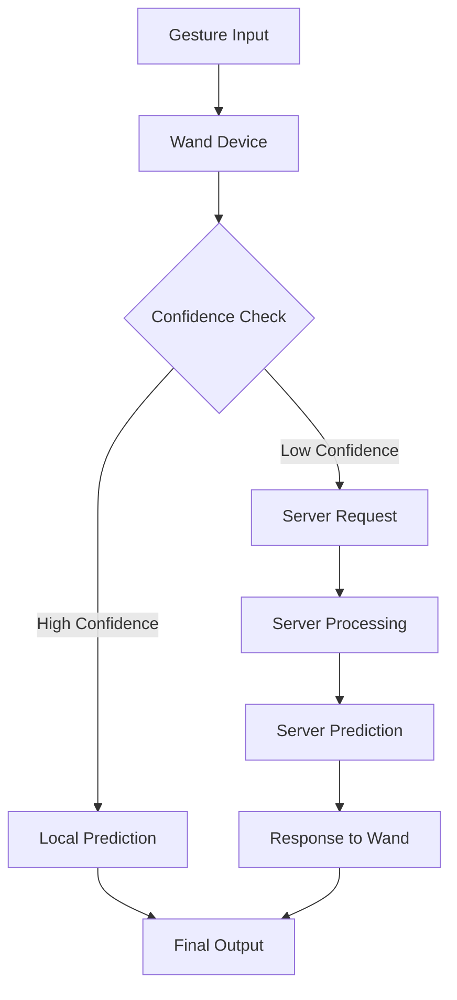

# Techin515-Lab5

This project is a gesture recognition application built using TensorFlow and Flask. It processes gesture data and serves predictions via a web interface.

## Edge Offloading

The application implements edge offloading to optimize performance. Here's a screenshot of the serial monitor showing the edge offloading process:


## Data Flow



## Setup

1. **Clone the repository:**
   ```sh
   git clone https://github.com/prunus77/Techin515-Lab5.git
   cd Techin515-Lab5
   ```

2. **Create a virtual environment:**
   ```sh
   python3 -m venv venv
   source venv/bin/activate  # On Windows, use `venv\Scripts\activate`
   ```

3. **Install dependencies:**
   ```sh
   pip install -r requirements.txt
   ```

## Usage

1. **Run the Flask application:**
   ```sh
   python app.py
   ```

2. **Access the application:**
   Open your browser and navigate to `http://localhost:5001`.

## Project Structure

- `app.py`: Main Flask application file.
- `rebuild_model.py`: Script to rebuild and save the TensorFlow model.
- `Data/`: Directory containing gesture data files.
- `App/`: Directory containing application-specific files.
- `Screenshots/`: Directory containing project screenshots and visualizations.

## License

This project is licensed under the MIT License - see the LICENSE file for details.

## Analysis

### Edge-First Approach

Our implementation uses an edge-first approach with server fallback for uncertain predictions. This approach has several implications:

#### Pros
- **Connectivity**: Works offline for high-confidence predictions
- **Latency**: Fast response for well-known gestures
- **Privacy**: Keeps sensitive data local when possible
- **Resource Efficiency**: Reduces server load for common cases

#### Cons
- **Connectivity**: Still requires server connection for uncertain cases
- **Latency**: Additional delay when falling back to server
- **Consistency**: Potential differences between edge and server predictions
- **Privacy**: Still sends data to server for uncertain cases

### Mitigation Strategy

To address the connectivity limitation, we recommend implementing a local prediction cache:
- Store recent server predictions for similar gestures
- Use cached predictions when offline
- Reduce dependency on constant server connectivity
- Maintain prediction quality without immediate server access 